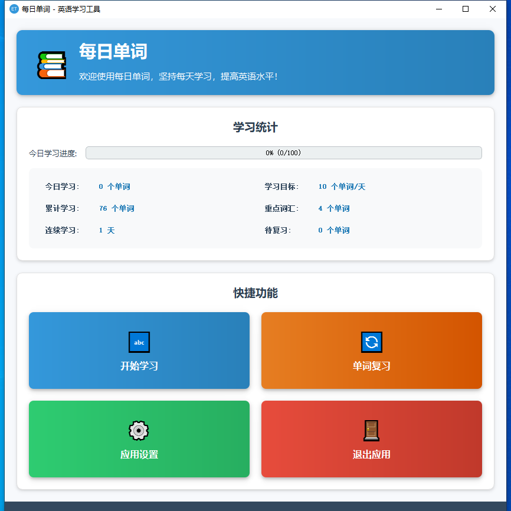
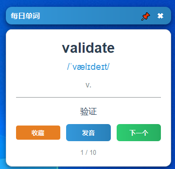
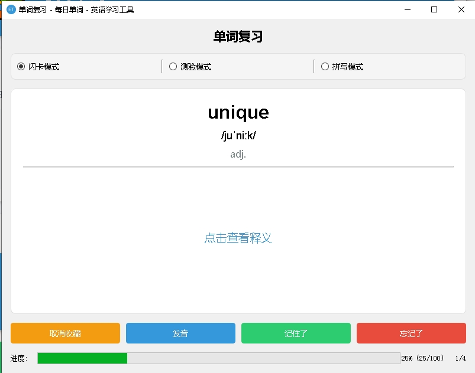
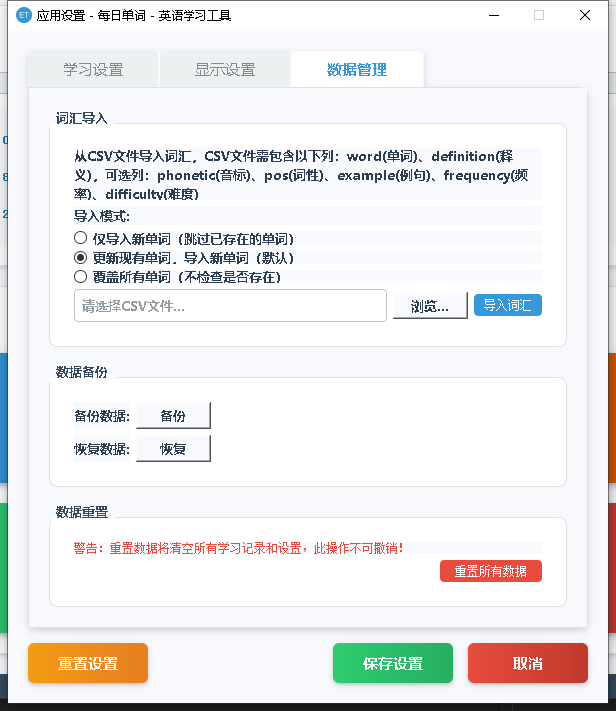

# 每日单词 - 英语学习工具

一款基于Python开发的英语词汇学习工具，采用科学的记忆曲线算法帮助用户高效记忆和复习英语单词。

## 主要功能

- **每日单词学习**：根据学习计划提供适量单词学习
- **记忆曲线复习**：基于科学的记忆曲线算法安排复习计划
- **悬浮窗模式**：不打扰日常工作的同时学习英语
- **单词发音**：支持单词发音功能
- **学习统计**：详细记录学习进度和成果
- **自定义设置**：灵活调整学习计划和界面

## 技术栈

- **PyQt5**：用于构建跨平台GUI界面
- **SQLite**：本地存储学习数据和词汇库
- **gTTS**：提供文本转语音功能
- **Pygame**：音频播放
- **PyInstaller**：打包为可执行文件

## 安装使用

### 从源码运行

1. 克隆项目
   ```
   git clone https://github.com/wy30115/English_learn_tool.git
   cd english_tool
   ```

2. 安装依赖
   ```
   pip install -r requirements.txt
   ```

3. 运行应用
   ```
   python src/main.py
   ```

### 从可执行文件运行

1. 下载最新的发布版本
2. 解压后直接运行`每日单词.exe`

## 构建应用

使用内置的打包脚本生成可执行文件：

```
python build.py
```

## 项目结构

```
english_tool/
├── src/
│   ├── core/       # 核心功能模块
│   ├── data/       # 数据管理模块
│   ├── ui/         # 用户界面模块
│   ├── utils/      # 工具函数
│   └── main.py     # 程序入口
├── data/           # 数据文件
├── assets/         # 资源文件
├── requirements.txt
├── build.py        # 打包脚本
└── README.md
```

## 已实现功能

1.主页界面

2.开始学习，显示单词悬浮窗  
  
3.复习界面  

4.导入导出自己需要的单词
csv格式导入单词，csv 的格式参考：[基础的单词](data\basic_vocabulary.csv)  
  

## 许可证

MIT License 